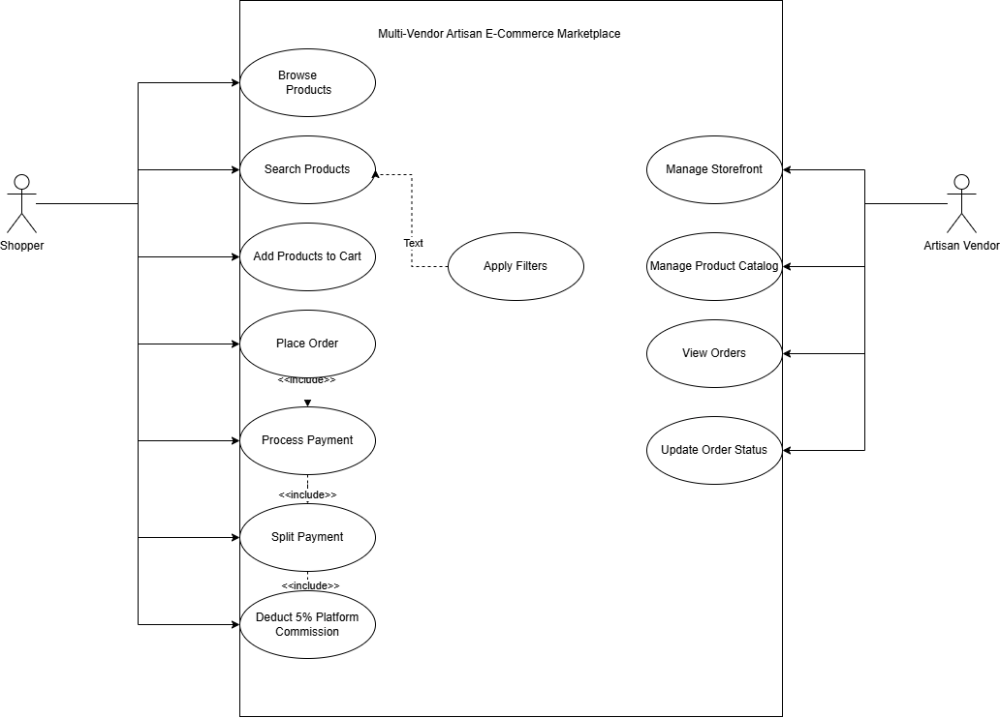

# Multi-Vendor Artisan E-Commerce Marketplace

## 1. Problem Statement

The system is an online marketplace that enables independent craftspeople
to set up storefronts, manage product catalogs, receive orders, and receive
automated split payouts with platform commission deductions.

---

# 2. Requirements

## 2.1 Functional Requirements

[Paste your complete Functional Requirements table from Requirements.md here.]

## 2.2 Non-Functional Requirements

[Paste your complete Non-Functional Requirements table from Requirements.md here.]

---

# 3. UML Use-Case Diagram

## 3.1 Actors

### Shopper

The Shopper browses and searches products, adds products to the cart,
places orders, and processes payments.

### Artisan Vendor

The Artisan Vendor manages the storefront and product catalog,
views orders, and updates order status.

## 3.2 Use Cases

### Shopper Use Cases

- Browse Products
- Search Products
- Apply Filters
- Add Products to Cart
- Place Order
- Process Payment
- Split Payment
- Deduct 5% Platform Commission

### Artisan Vendor Use Cases

- Manage Storefront
- Manage Product Catalog
- View Orders
- Update Order Status

## 3.3 UML Relationships

- `Place Order` includes `Process Payment`.
- `Process Payment` includes `Split Payment`.
- `Split Payment` includes `Deduct 5% Platform Commission`.
- `Apply Filters` extends `Search Products`.

---

# 4. Use Case Flow — Split Payment

## Use Case ID

UC-01

## Use Case Name

Split Payment

## Primary Actor

Shopper

## Supporting Actor

Artisan Vendor

## Preconditions

1. The Shopper has selected products from one or more Artisan Vendors.
2. The selected products have been added to the Shopper's cart.
3. The Shopper has proceeded to checkout.
4. The total cart payment amount has been calculated.
5. The payment information provided by the Shopper is valid.

## Main Success Scenario

1. The Shopper proceeds to checkout.
2. The system calculates the total amount of the Shopper's cart.
3. The system identifies the Artisan Vendor associated with each product in the order.
4. The system processes the Shopper's payment.
5. The system calculates the 5% platform commission.
6. The system deducts the 5% platform commission from the total payment.
7. The system calculates the amount payable to each Artisan Vendor.
8. The system splits the remaining payment among the respective Artisan Vendors.
9. The system verifies that the vendor payouts and the platform commission equal the original payment amount.
10. The system records the successful payment and corresponding vendor payouts.
11. The system confirms successful payment to the Shopper.

## Alternate Flows

### A1. Payment Failure

1. The system attempts to process the payment.
2. The payment fails.
3. The system does not create vendor payouts.
4. The system informs the Shopper that the payment was unsuccessful.
5. The Shopper may retry the payment.

### A2. Invalid Payment Split

1. The system calculates the vendor payouts and platform commission.
2. The system detects that the calculated amounts do not equal the original payment amount.
3. The system does not complete the payout.
4. The system records the payment split error.
5. The system informs the appropriate administrator or displays an error message.

### A3. Multiple Artisan Vendors

1. The system identifies multiple Artisan Vendors in the Shopper's order.
2. The system calculates the amount attributable to each Artisan Vendor.
3. The system calculates and deducts the 5% platform commission.
4. The system distributes the remaining payment among the respective Artisan Vendors.
5. The system verifies that the total payouts and commission equal the original payment amount.

## Postconditions

1. The Shopper's payment is successfully recorded.
2. The 5% platform commission is recorded.
3. The appropriate payout amount is calculated for each Artisan Vendor.
4. The split payouts are recorded for the respective Artisan Vendors.
5. The order is marked as successfully paid.